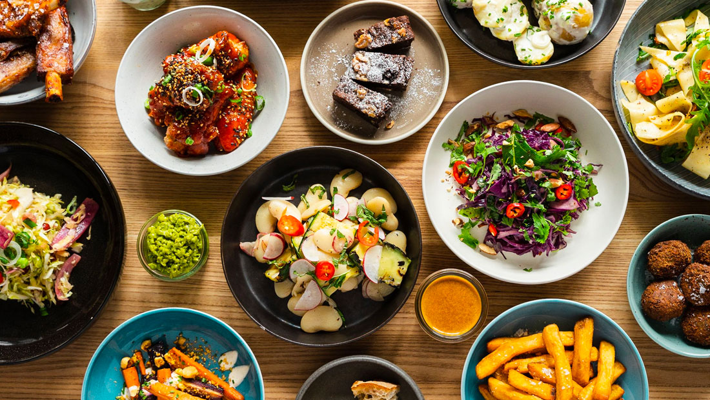

# Foodie API for healthy foodies! Restaurant recommender API and dish calories calculations in real time

## Resume

This API aims to be both a restaurant recommender and a calories calculator. This last one is achieved by means of machine learning: neural nets trainning on 5 different dishes.

The final deployment can be found in the following link:

The script is developed in Python and deployed as a Docker image on Heroku.

This project is my final project of Ironhack's Data Analytics Fulltime Bootcamp.

## Resources
For this project, the following APIs have been used. Specially thanks to their contributors for spreading so rich information:

* **Food Images (Food-101)**--> https://www.kaggle.com/kmader/food41
The dataset contains a number of different subsets of the full food-101 data. The idea is to make a more exciting simple training set for image analysis than CIFAR10 or MNIST. For this reason the data includes massively downscaled versions of the images to enable quick tests. 

The data has been reformatted as HDF5 and specifically Keras HDF5Matrix which allows them to be easily read in. The file names indicate the contents of the file. 

On behalf of data protection, the dataset has not been uploaded to Github.

* **FourSquare API**--> https://developer.foursquare.com/docs/api-reference

This dataset contains over 16000 movie an TV series and their appearance on different streamming platforms.

* **Spoonacular API**--> https://spoonacular.com/food-api/

The spoonacular Nutrition, Recipe, and Food API allows you to access over 365,000 recipes and 86,000 food products. It makes it possible to search for recipes using natural language queries, such as "gluten free brownies without sugar" or "low fat vegan cupcakes." 

It also calculates the nutritional information for any recipe, which will be used for this project.

## Structure

1) README.txt: As a resume for the content of the project an its development

2) server.py: It contains the main script for the project

3) src: It contains relevant files so that the code can be runned. 
    a)Inception_V6.ipynb: The NN trainning on Google Colab

    b)api_gen.py: Definition of endpoints along the API

    c)data_extraction.py: Auxiliar functions for the API

    d)image_prediction.ipynb: Auxiliar jupyter notebook where the Inception model is loaded, and a photo is analyzed

    e)html-> It contains every html file for the endpoints' display

4) static: Where APIs images are saved; i.e: cover background, icon, etc.

5) templates: Where templates for the endpoints are saved

## Project development

In progress!!!

## Conclusions

In progress!!!
   